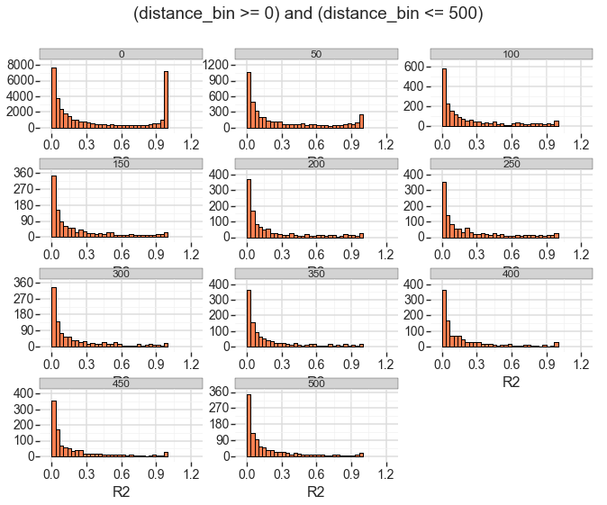

% Tsetse ddRAD
% Gus
% 2015-04-13


# Overview #

------------------------------------------

### Population Locations ### 


------------------------------------------


    PCA: 73, 297 SNPs:

    Variance:

    PCA1: 0.3% 
    PCA2: 0.09%
    PCA3: 0.04%.

------------------------------------------


    FastStructure: 47,997 SNPs that met HWE expectations after
                   BH correction.

    - A) K=2 
    - B) K= 3
    - Infected individuals indicated with asterisk


# Linkage disequilibrium # 


------------------------------------------


the co-occurrence of allele-pairs within chromosomes in a population at frequencies unexpected given the overall frequencies of each allele in the population __assuming random assortment__ between alleles

------------------------------------------

> - can't assume random assortment
> - SNP-pairs separated by differing distances will have different thresholds to define "interesting" values of LD
> - The recombination rate of _G. f. fuscipes_ is not well established
 
<div class="notes">
1. distance between loci is __inversely proportional__ to the rate of recombination between syntenic loci.
2. because of __differing recombination rates.__
</div>

------------------------------------------

Grouped SNP-pair into bins of similar separation


------------------------------------------

50 bp non-overlapping windows


------------------------------------------

#### Typical mean LD vs Separation ####


<div class="notes">
- Example of what typical Avg LD vs Separation distance looks like
- each dot is the avg LD for the bin
- the line is the regression

</div>

------------------------------------------

#### Our data ####


<div class="notes">
- Looks very similar to Marks
- Maybe even a bit cleaner (dots spread less)
- 30X as far as first panel in Mark's

</div>


------------------------------------------

#### Our data (long range) ####


<div class="notes">
- Wow.  
- What is going on?

</div>

------------------------------------------

#### What else is going on here? ####


<div class="notes">
- Wanted to see if I could __tie this to some other pattern__ in the data
- Can I blame this on something and better interpret it?
- Nothing makes an __OBVIOUS__ change at that distance that I looked at
- Mark said he also saw crazy stuff like that it just took longer to happen
- __Perhaps this is down to our specific ddRAD conditions__
- __Maybe low population sizes?__
- 
</div>


------------------------------------------

### Must be careful when looking at LD.. ###

<div class="notes">
- Treatment of bin members must be adaptive
- bins with longer distances drop in __contig rep__ and __SNP-pair members__
- we will want our threshold to take the amount of data we have into account
- Suggest Bayesian methods
</div>


------------------------------------------

Smells Bayesian


------------------------------------------

What will our model look like?


------------------------------------------

What do the DATA look like?


------------------------------------------

__$r^2$ distributions when $d$ is small:__ 



<div class="notes">
- X = LD
- Y = SNP-pairs per LD-score

- Each bin-set from 0 to 500
- bin range __STARTS__ at its "name"

- Is this pattern __representative__?

</div>


------------------------------------------

Yes...


------------------------------------------

Mostly.


------------------------------------------

__$r^2$ distributions when $d$ is LARGE:__ 


<div class="notes">
- This is bc data becomes sparse as $d$ increases
- reiterates the need for taking the amount of data into account

</div>


# Bayesian LD thresholding #


------------------------------------------

How do we build a Bayesian model?!


------------------------------------------

>1. What kind of probability distribution would you use if you wanted to <font color="#BA8800">__GENERATE__</font> your data?
>2. What are the parameters that the distribution needs to describe itself?
    - __Normal:__ <font color="#BA8800">_mean_</font> and <font color="#BA8800">_standard deviation_</font>
>3. What kinds of distributions could be used to <font color="#BA8800">__randomly__</font> vary the choice of values to feed into your model's parameters?


------------------------------------------

What does the data tell us about how our model should look?

- Data is bounded between $0$ and $1$
- Probability not $N()$
- Continuous
- Needs to accommodate two peaks


------------------------------------------

The Beta distribution mostly fits these qualities:


<div class="notes">
- parameters: alpha and beta
- bounded by 0 and 1 __non-inclusive__
- VERY flexible shapes can deal with two peaks
- __just need to deal with the boundary issue__
</div>


------------------------------------------

Some of our data have values of 0 or 1.


------------------------------------------

So I needed to scale our data slightly:

$$((x_i - 0.5)\cdot \theta) + 0.5$$

<div class="notes">
- shift data to the left by 0.5
    - 0.5 >> 0
    - 1 >> 0.5
    - 0 >> -0.5
- multiply all points by factor $\theta$
- shift the points back to the right by 0.5
</div>


------------------------------------------

1. What kind of probability distribution would you use if you wanted to <font color="#BA8800">__GENERATE__</font> your data?

> - Beta

------------------------------------------

2. What are the parameters that the distribution needs to describe itself?

>- Beta: <font color="#BA8800">$\alpha$</font> and <font color="#BA8800">$\beta$</font>
>- both can take any positive value.


------------------------------------------

3. What kinds of distributions could be used to <font color="#BA8800">__randomly__</font> vary the choice of values to feed into your model's parameters?

> - [We have data](#2/13) so we can inform our <font color="#BA8800">prior</font> expectations of the parameter's behavior

<div class="notes">
- but we know what our data look like so we dont have to consider ALL values in the Natural set

</div>


------------------------------------------

### The model: ###


<div class="notes">
- ovals are probability distributions
- circles are __modeled__ parameters of a parent distribution
- grey oval means the distribution considers observed data.
</div>


------------------------------------------


Now for the fun part!


> - more <font color="#BA8800">MATH</font> about how this was implemented!!!

------------------------------------------

Just kidding


------------------------------------------

## Thresholding results ##


------------------------------------------

How many SNP-pairs: 

```
6735 at p-value of <= 0.05
5284 at <= 0.01.
```

------------------------------------------

Lowest accepted $r^2$:

```
0.82
```

------------------------------------------

How much better than setting threshold at 0.82? 

_(rough <font color="#BA8800">sensitivity</font>)_

```
80% more *selective*
```


<div class="notes">
Not surprisingly, they ALL have r^2 very close to 1, so it does not make
sense to compare the filtered pairs to ALL SNP-pairs, but there are
14845 pairs that have r^2 = 1. So I AM being a little discriminatory
(selectivity). However, I am also able to pick pairs that have r^2
values as low as 0.82, so my sensitivity is also better than just
selecting some naive and HIGH r^2 threshold.

Compared to a hypothetical naive threshold of r^2 >= 0.82, which matches
the *sensitivity* of my method, my method is 80% more *selective*.


</div>


------------------------------------------

How do the filtered SNP-pairs compare to unfiltered?


------------------------------------------

Contig length (ALL SNP-pairs):


<div class="notes">
- explain asterisks
</div>


------------------------------------------

Contig length (0.01 SNP-pairs):


<div class="notes">
- explain asterisks
</div>


------------------------------------------

How does p-value change with SNP-pair separation?


------------------------------------------

Filtered (0.01) SNP-pairs in windows with Tajima's D $\ge 2$ ?


# Functional Annotations#


