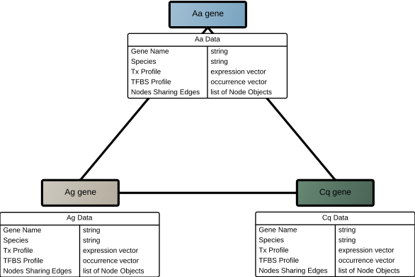
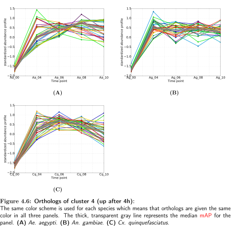
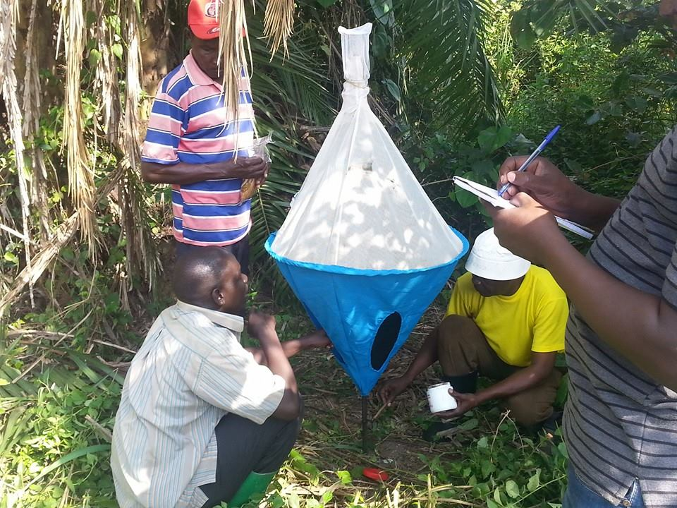

name: inverse
layout: true
class: center, middle, inverse

---

# From gene regulation to phylogeography #
## .accent1[Integrating HTS to study diverse questions] ##
### 2015-09-04 ###
#### Gus Dunn ####


---

template: inverse
# .accent3[A brief history of me]

---

layout: false

# Training: #

## .accent2[Undergraduate] ##


- Degree in biology and molecular genetics: _.accent3[University of Georgia]_


__After graduation:__

- Research professional/Lab manager:
    - gene annotation and expression in _Anopheles gambiae_
    - began to teach myself Perl to automate:
        - annotation
        - qRT-PCR primer design
        - analysis
    - Switched to Python and NEVER looked back.

---


# Training: #

## .accent2[Doctorate] ##

- Department of Molecular Biology and Biochemistry: _.accent3[Univ of California, Irvine]_
- transgenic mosquito lab 
- RNA-seq
- Motif discovery
- _.accent1[Biomedical Informatics Training grant]_ (NIH/NLM)
    - Co-adviser in Computer Science
    - Computational Biology course work


---

template: inverse

## .accent1[I speak Molecular Biology] .accent3[and] .accent1[Bioinformatics] ##

???

- I may drift too far into Bioinformatics from time to time
- Please just ask me to say stuff more in Molecular Biology, and I will try to say it differenty

---

template: inverse


# .accent2[Integrated "Omics" analysis to identify conserved transcription profiles] #


---
template: inverse
# .accent1[Master Goal?] #

---
template: inverse
## .accent1[ Build mosquito that does not transmit malaria/dengue... ] ##

---
template: inverse
## .accent1[ ...introgress trait into affected populations. ] ##

---
layout: false
class: middle
## Elements of a successful transgenic mosquito product ##

1. ability to introduce transgenes into the vector genome in a heritable way

--
count: false
2. discovery or construction of effector genes

--
count: false
3. ability to control when and where the effector genes are expressed

--
count: false
4. ability of transgenic vectors to spread anti-pathogen genes to near-fixation on a _.accent3[public health timescale]_


---
count: false
class: middle
## Elements of a successful transgenic mosquito product ##

1. ability to introduce transgenes into the vector genome in a heritable way

2. discovery or construction of effector genes

3. _.accent5[ability to control when and where the effector genes are expressed]_

4. ability of transgenic vectors to spread anti-pathogen genes to near-fixation on a _.accent3[public health timescale]_


---

template: inverse
# .accent1[What problem am I trying to address?] #

---
class: middle
## It is hard to make and test promoters in transgenic mosquitoes ##

- Promoters were blackboxes

- Promoter bashing is cost and time prohibitive if not simply _.accent3[impossible]_

- Promoters that work in one species may not work as expected in other species or genetic backgrounds

???

- RANDOM INSERTION
- __How different are malaria vs dengue mosquitoes?__

---

class: middle

<figure>
  
   <figcaption>Phylogenetic depth of the mosquito clade.</figcaption>
</figure>


---
template: inverse

## .accent1[can I use an] .accent2[integrative approach] .accent1[to identify promoters that are more likely to behave similarly across the whole mosquito clade?] ##


---
class: middle

<figure>
  
   <figcaption>Overview of integrative approach.</figcaption>
</figure>

---
template: inverse

## .accent1[blacktie] ##

---
class: middle
## Why I wrote `blacktie` ##

- my lab did quite a bit of transcriptomics

--
count: false
- NOT bioinformaticians

--
count: false
- reproducible 

--
count: false
- simplify analysis to lower execution threshold

--
count: false
- be as much of a push-button-yield-results as is feasible


---

class: middle
<figure>
  
   <figcaption><b>Abbreviated</b> Tophat/Cufflinks Inputs and Outputs.</figcaption>
</figure>

---

class: middle


```
blacktie --prog all --mode analyze config_file.yaml
```

--
count: false
[config_file.yaml](https://blacktie.readthedocs.org/en/latest/tutorial.html#the-configuration-file)

---
class: middle
<figure>
  
   <figcaption>CummeRbund figures automatically produced by blacktie.</figcaption>
</figure>

---
template: inverse

## .accent1[gfunc] ##

---
class: middle

<figure>
  
   <figcaption>Overview of integrative approach.</figcaption>
</figure>

---
class: middle
## Why I wrote `gfunc` ##

- provide framework to integrate disparate forms of .accent1[OMICS] class data into coherent analyzable form

--
count: false
- be extensible

--
count: false
- reproducible

---
class: middle

<figure>
  
   <figcaption>Node data.</figcaption>
</figure>

---
class: middle

<figure>
  
   <figcaption>Edge data.</figcaption>
</figure>

---
class: middle

# `$$\mathrm{PTCI} = \left( r_{x} + \frac{r_{t}}{2} \right) \cdot w(d)$$`

---
class: middle

<figure>
  
   <figcaption>1:1:1 ortholog PTCI.</figcaption>
</figure>

---
class: middle

<figure>
  
</figure>

---
template: inverse
# .accent2[ddRAD-based Phylogeography and population genomics of Tsetse flies in Uganda] #


---

class: middle center

<figure>
  
   <figcaption>Pilot ddRAD sample sites.</figcaption>
</figure>

---
template:inverse
# .accent1[Master Goals?] #

---

class: middle
# Public health: 
- Eventually provide a master .accent3[SNP-Chip] for Sleeping Sickness surveillance/study/control

- provide base-line data BEFORE merging of Tbg/Tbr 

- study effect Tbr/Tbg/other symbionts may have had on Tsetse genome


# More academic: 
- gene flow

- genetic history of Gff in Uganda

---
template: inverse
# .accent1[First Step: generate SNP database] #

---
template: inverse
## .accent3[Collecting] ##

---

<figure>
  
  <figcaption>Biconical tsetse trap.</figcaption>
</figure>

---

<figure>
  
  <figcaption>Milking the traps.</figcaption>
</figure>

---
template: inverse
## .accent3[ddRAD] ##

---
template: inverse
## .accent3[SNP calling] ##

---
template: inverse
## .accent3[Comparative analyses] ##

---

class: middle center

<figure>
  
   <figcaption>Pilot ddRAD sample sites.</figcaption>
</figure>

---

class: middle center

<figure>
  
   <figcaption>PCAdapt: Bayesian factor analysis reveals geographic differentiation.</figcaption>
</figure>

---

class: middle center

<figure>
  
   <figcaption>PCAdapt: searching for local adaptation.</figcaption>
</figure>

---

template: inverse
# .accent6[Thank you] #